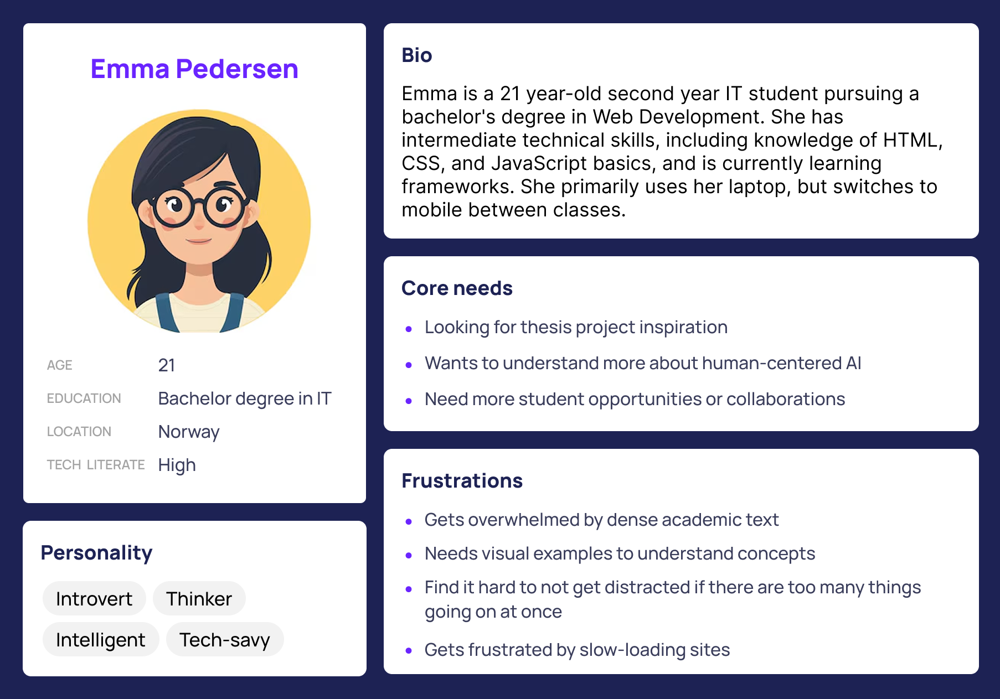
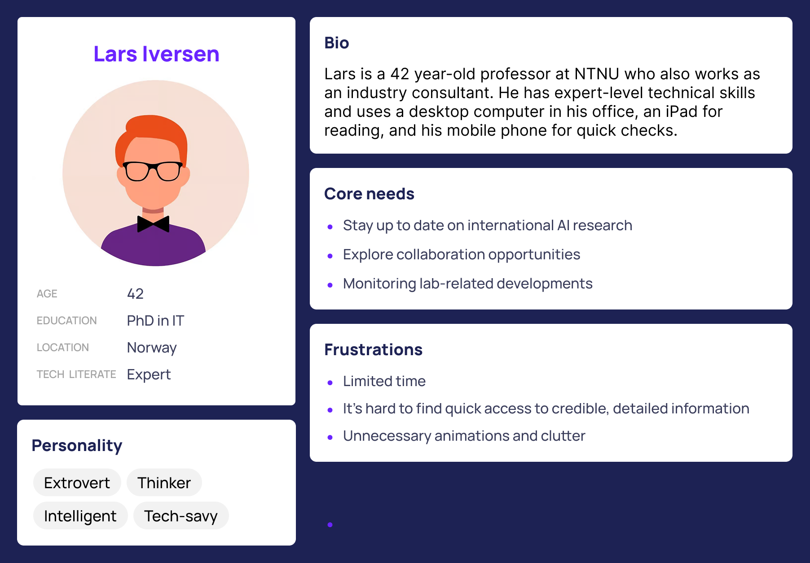
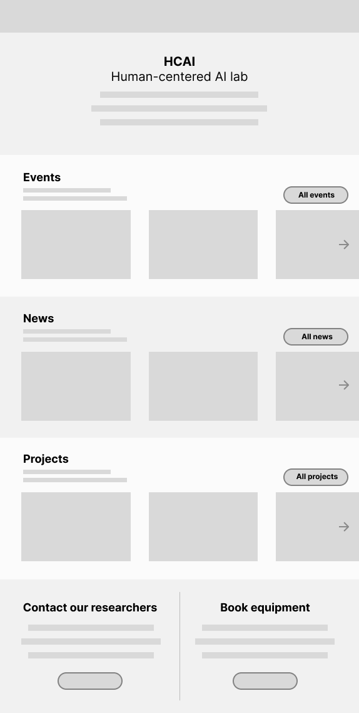
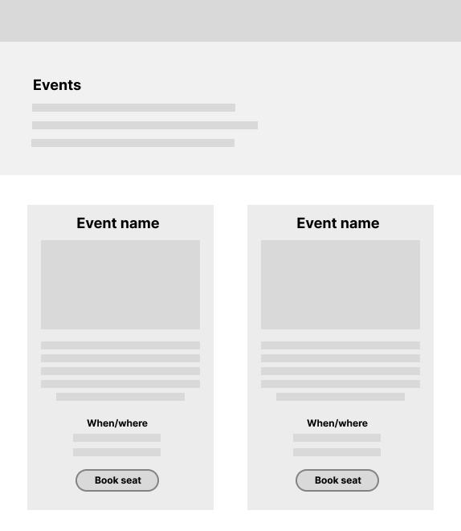
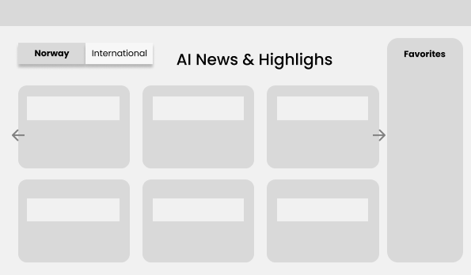
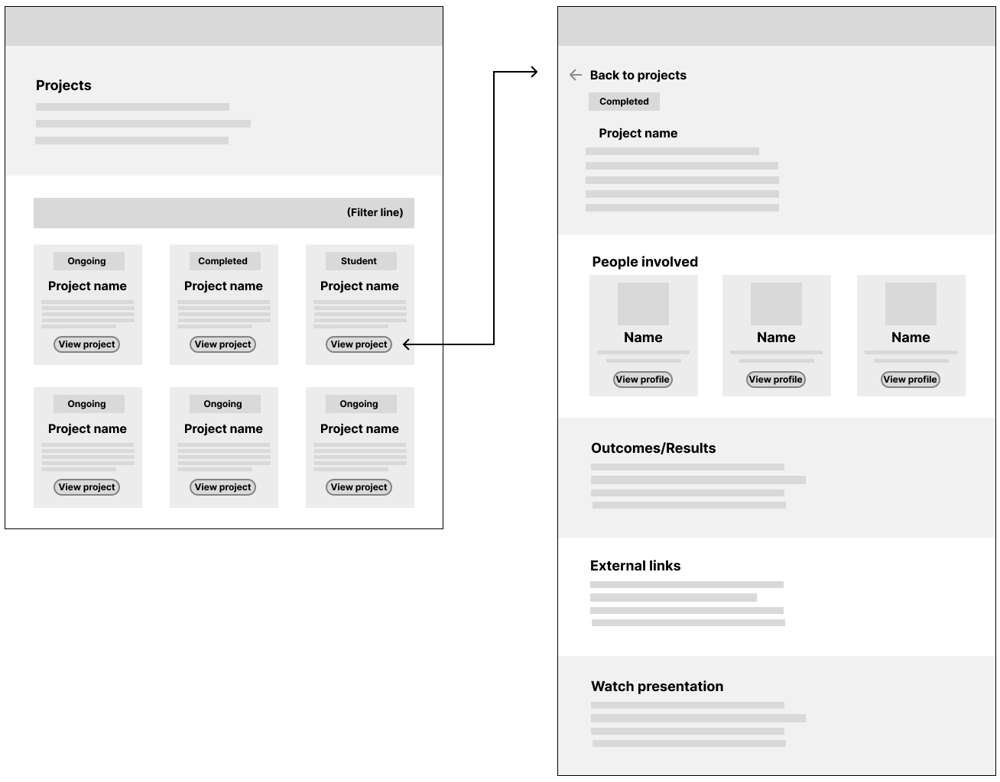
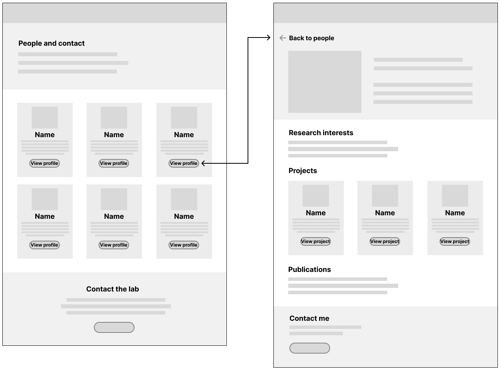
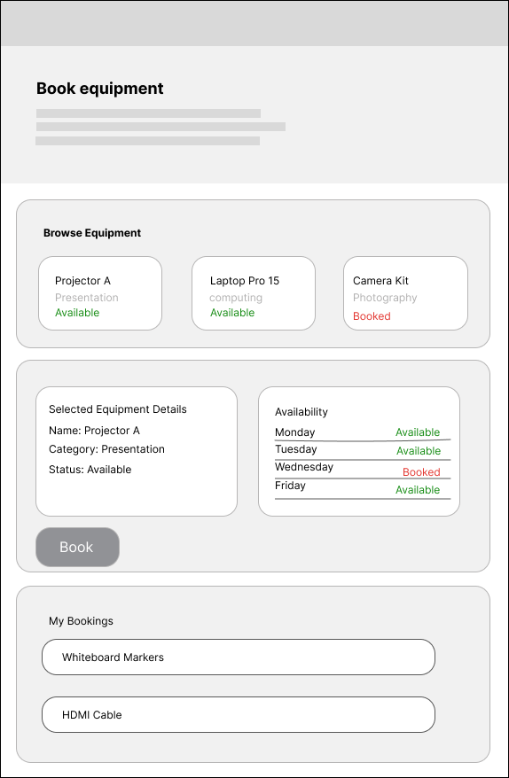
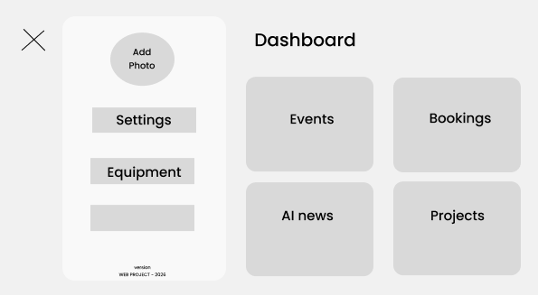

# Requirement Specification – HCAI Lab Website
## 1. Introductory Information
**Purpose of the document**\
This document describes the requirements for a web-based solution for NTNU’s Human-Centered AI (HCAI) Lab.

**Authors:** \
Nicolai Buseth \
Tuva Konstanse Hansen \
Chanya Sanboonsiri 

**Dates & Milestones:**
- Lo-fi Prototype: Week 7–8
- Design: Week 8–9
- High-fidelity Prototype: Week 8–10
- Development: Week 10–18
- Testing: Week 16–18
- Finalization: Week 18–20

**Project stakeholders:**\
Primary stakeholder: NTNU Human-Centered AI Lab

Secondary stakeholders:
- Students (bachelor, master, PhD)
- Researchers and professors affiliated with the lab
- Industry partners and external collaborators
- Visitors interested in AI research and activities at NTNU

**Executive Summary**\
NTNU’s Human-Centered AI Lab requires a web-based solution that presents clear and up-to-date information about the lab’s activities, people, projects, events, equipment, and relevant AI-related news. The website is intended to serve as a central entry point for students, researchers, and external collaborators seeking information about the lab and its offerings.\

The solution will focus on structured, accessible content and simple interaction flows, including event information, project overviews, and equipment booking. A dedicated display mode will support on-site information sharing through a rotating visual layout. The system prioritizes usability, accessibility, and maintainability, while deliberately excluding advanced personalization, social interaction, and payment functionality to keep the scope focused and manageable.

## 2. Business Objectives and Business Requirements 
This section describes the Product Owner's reasons for wanting the system (business objectives) and how the system is expected to meet these needs (business requirements). The main solution is a website, where one of the pages contains a display-style presentation of selected information.

The following business requirements describe how the system will support and fulfill the defined business objectives. 

**Business Objectives**
- BO-1: Provide a clear digital presence for the HCAI Lab. The HCAI Lab needs a website that clearly explains who they are, what they do and what kind of work they are involved in. The website will act as the main digital entry point for the lab. 
- BO-2: Communicate lab activities, projects and AI-related news in a clear way. The lab is involved in several projects and activities that are relevant to students, teachers, researchers and external partners. The website should present this information in a structured and understandable manner. One page will work as a display-style view to highlight selected content. 
- BO-3: Attract students, teachers, researchers and external partners by making information easy to find and easy to understand. The Lab wants to encourage more people to their work and get in contact.

**Business Requirements**
- BR-1: The system shall be implemented as a website that represents up-to-date information about the HCAI Lab and its projects. This ensures that visitors always receive relevant and correct information. 
- BR-2: The system shall include a page that presents selected information in a display-oriented and visual format. This supports highlighting important content more engagingly. 
- BR-3: The system shall allow users to easily find contact information. Users should also be able to locate contact details without unnecessary navigation. 
- BR-4: The system shall represent AI-related news and lab activities in a structured way. This helps users stay informed and understand what is currently happening in the lab. 

## 3. Personas / Archetypes and Usage Scenarios 
This section describes the main target users of the HCAI lab website and how they will interact with the system to accomplish specific tasks. The primary users include ID students, professors, researchers, and individuals who are interested in AI and technology. Each persona represents a typical user with distinct goals, motivations, and pain points that result in how they navigate and use the website. 

### Person 1: Student - Emma
Emma is a 21 year-old second year IT student pursuing a bachelor's degree in Web Development. She has intermediate technical skills, including knowledge of HTML, CSS, and JavaScript basics, and is currently learning frameworks. She primarily uses her laptop but switches to mobile between classes. 

Emma is looking for thesis project inspiration and wants to understand what  "human-centered AI" actually means. She hopes to find student opportunities or collaborations and prefers learning through dialogue. However, she gets overwhelmed by dense academic text, needs visual examples to understand concepts, has limited time to deep-dive between classes, and feels intimidated by contacting professors directly. Emma also finds it hard to not get distracted if there are too many going on at once.

Emma is comfortable navigating modern websites and expects mobile-friendly designs. She uses social media daily, including Instagram, TikTok, and Pinterest, which shapes her aesthetic expectations. She becomes frustrated by slow-loading sites.

**Usage Scenario: Emma AI news discovery**\
User Goal: Stay updated on AI developments relevant to her studies

Emma opens the HCAI website on her phone before class and taps "AI News" in the main navigation. The page loads quickly and displays a grid of news cards with headlines, dates, and short summaries. She switches the toggle from International to Norwegian to find information about local regulations. She opens a news card and reads a summary in a modal that includes a "Why it matters for students" note explaining the relevance to her coursework. After reading, she closes the modal, bookmarks the page, and heads to class feeling informed and prepared for discussions.

Expected Outcome: Emma finds relevant news in under 2 minutes, understands why the news matters to her studies, and feels prepared and confident for class discussions. 

### Persona 2: Professor - Lars
Lars is a 42-year-old associate professor at NTNU who also works as an industry consultant. He has expert-level technical skills and uses a desktop computer in his office, an iPad for reading, and his mobile phone for quick checks.

Lars aims to stay up to date on international AI research, identify relevant publications for grant applications, explore collaboration opportunities, and monitor lab-related developments. His main challenges include limited time, the need for quick access to credible, detailed information, and a dislike of unnecessary animations or clutter.

Lars is highly comfortable with technology and expects professional, academic-quality content. He values efficiency and clarity in digital interfaces.

**Usage scenario: Dr.Lars quick news check** \
User Goal: Stay updated on international AI research developments

Dr. Lars opens the HCAI website on his laptop during a short break between meetings and clicks "AI News" from the main navigation. The page defaults to International news based on his saved preference from a previous visit. He quickly scans headlines related to explainable AI and major conferences, then opens a relevant article in a modal. He copies a link to a list of accepted papers for future reference and closes the modal. He briefly toggles to Norwegian news to check for local funding announcements, then exits the site to attend his next meeting.

Expected Outcome: Dr. Lars quickly identifies relevant research updates, evaluates articles efficiently, and leaves with actionable information in under 3 minutes.

## 4. User Requirements
This section outlines the user requirements and describes the planned capabilities of the system from the user’s perspective. All requirements are written in the user story format.The user stories collectively describe both visitor and administrator facing features of the system. Covering interactions such as exploring lab projects, accessing related news, managing contents through admin dashboard, registering for events and booking lab equipment. These requirements ensure that the system supports easier navigation, accessibility, and efficient content management while meeting the needs of different users. 

### Visiting Projects page
John, a 23 year old student at NTNU wants to view projects and access more detailed information about each project, so that he can understand what kinds of projects are done at the lab and who is involved.

**Acceptance Criteria**
- The system shall provide a Projects section with an overview of projects.
- The user shall be able to access a dedicated page for an individual project.
- Project information shall be presented in a clear and structured way.
- The solution shall support basic filtering or categorization of projects.

### Visiting the AI News page
As a visitor (student) I want to browse recent AI-related news with regional filtering so that I can stay informed about developments relevant to my context and studies.

**Acceptance Criteria**
- When I click “AI news” in the main navigation, I am navigated to the AI news page within 3 seconds or less. 
- The page will display a clear title, “AI news & Highlights” at the top. A toggle control is visible with two options labeled “Norwegian” and “international” for filtering news by region 
- A grid of news cards is displayed on the page, showing at least 6 cards visible without scrolling on desktop devices, etc. News cards are fully clickable, display hover effects, and support keyboard navigation (Tab to focus, Enter/Space to activate). When I switch the toggle between Norwegian and International news, the cards switch to regional news. 
- If the API fails to load, an error state displays with a warning icon, error message "Unable to load news", and a "Retry" button.
- Highlighted articles appear at the top of the grid with a gold star icon and display a tooltip "Highlighted by HCAI" on hover.
- The page is fully accessible using keyboard-only navigation and compatible with screen readers.

### User story - Admin Dashboard: 
As a lab administrator, I want to manage news articles, projects, and events through a dashboard so that I can keep website content current without requiring technical knowledge.

**Acceptance Criteria:**
- The admin dashboard displays a table of existing articles with columns for key information, an "Add New Article" button, search functionality, and filter options.
- A form is provided for adding or editing articles with required fields (headline, summary, source information, region, date) and optional fields (image, relevance note, highlight status).
- The form validates required fields and provides clear feedback on successful saves or errors.
- Delete actions require confirmation and display success messages after completion.
- The system enforces a maximum of 3 highlighted articles with appropriate warning messages.
- The dashboard includes controls for managing all content types (equipment, bookings, events, people, projects, news) and display settings.

### User story - Event Page:
As a student, I want to view detailed information about an event and register for it, so that I can decide whether to attend and secure a spot.

**Acceptance Criteria:**
- The event page displays the event title, date, time, location, and description.
- The page shows the number of available spots or indicates if the event is fully booked.
- The user can register for the event by providing their name and email address.
- The system validates that:
    - The name field is not empty.
    - The email address is in a valid format.
- When the registration is successful:
    - A clear confirmation message is shown to the user.
    - The number of available spots is updated.
- If the event is fully booked:
    - The registration option is disabled or clearly marked as unavailable.
- Error messages are clearly presented if input validation fails or if a system error occurs.
- The registration process is accessible using a keyboard and readable by screen readers.

### User story - Equipment Booking:
As a student, Jonas wants to browse available lab equipment and book it for a specific day so that I can use the lab´s resources for my project or coursework. 

**Acceptance Criteria**
Equipment Overview
- When the user navigates to the “Equipment” page, a grid-based layout of available equipment is displayed.
- Each equipment card shall display: 
    - Equipment name
    - Category (Presentation, computing, Photography)
    - Current status (Available/Booked).
- Equipment status shall be visually distinguishable using color indicators (green = available, red = booked).
- The system shall clearly indicate which equipment item is currently selected by highlighting the selected card visually.

Booking Interaction
- A “Book” button shall be visible when the selected equipment has at least one available day. 
- The user must select a specific available day before confirming booking. 
- When the user clicks “Book”:
    - The selected day status updates to “Booked”.
    - A confirmation message displayed: “Booking Successfull.”
- If the selected day is already booked:
    - The booking button shall be disabled 

My Bookings
- A “My Bookings” section lists equipment booked by the user.
- The list updates immediately after booking.
- The user can cancel a booking, which updates availability accordingly. 

## 5. Anti-Requirements
- The system will not provide public user accounts or registration, authentication is limited to administrative users only.
- The system will not support payments, deposits, fines, or any form of e-commerce related to events or equipment bookings.
- The system will not include community or social features, such as comments, likes, forums, or direct messaging.
- The system will not allow public submission or editing of content, including projects, events, news, or people profiles.
- The system will not store sensitive personal data beyond what is strictly necessary for basic contact and booking functionality.

## 6. Non-Functional Requirements
**Accessibility**\
The website shall comply with WCAG 2.1 AA accessibility standards to ensure it is usable by a wide range of users.
- All pages shall support keyboard navigation and screen readers, and use high contrast colors.
- Content intended for the display mode shall be readable from a distance, using large typography, high contrast, and minimal text.
- Any QR-code–linked content shall be accessible on mobile devices.

**Usability**\
The system shall be intuitive and easy to use for both students and lab staff:
- The purpose of the website and the display-compatible views shall be immediately understandable to first-time users.
- Users shall be able to access key information, such as upcoming events, AI news, and equipment booking, within a maximum of three interactions.
- Content presented on the display shall be visually structured and understandable within a few seconds, without requiring detailed reading.

**Performance**\
The website shall load efficiently to support both regular browser use and continuous display usage.
- Pages shall load within two seconds under normal network conditions.
- Display-compatible views shall be optimized for continuous operation, with smooth transitions between content sections, and no noticeable lag.
- The system shall be stable enough to run for extended periods without requiring manual refresh or intervention.

**Security**\
Administrative functionality, including content management, event creation, and equipment management, shall be protected by authenticated login.
- Only authorized admin users shall be able to access the admin dashboard and modify system content.
- User data related to event registrations and equipment bookings shall be handled securely and protected against unauthorized access or modification.
 
**Maintainability and Scalability**\
The system shall be designed to allow lab staff to update content easily without requiring technical expertise. 
- The architecture shall support future expansion, such as adding new content types (e.g. student projects or research highlights) or extending display functionality, without requiring major changes to the existing system.

## 7. Website Diagram / Sitemap and Wireframes
To show the functionality and layout of the website we’ve created some low-fi prototypes/wireframes. These are mainly for the website, and the display will be based on this layout later on.

**Homepage:**\
This page will have information about the lab, show some events, some AI news and some projects, with a button to all the pages as well. In addition to this you will also find information about how to contact the researchers (and why you might need to), and how to book equipment.

**Event page:**\
The event page will include all the events going on with a short description and the most important information. You’ll have to book a seat through the button.

**News page:**\
The AI news page will have a toggle button between Norwegian news and international news. The user will be able to scroll through summaries of the most relevant AI news, click on a card to read more, and also add to favorites if they want to keep something.

**Projects page:**\
This page will include all projects, both from students and researchers. You can filter through the project types you’re looking for, and view if the project is on going or completed. 

If you click on “View project” you will be sent to a new page with information about the project. Here you can see a description, the people involved, outcomes/results (if the project is completed), external links and maybe videos etc. 

**Researchers/contact page:**\
On this page you will find all the employees/researchers related to the lab. Here you can read the most important information about each person (e.g. how to contact, and what they are researching).

If you click on “view person” you will get to a separate page, where you can read more about research interests, previous projects, publications etc. You will also find the contact information here as well.

**Equipment booking page:**\
This page includes information about equipment booking. You can see what type of equipment that is available. When you click on an equipment, you will get information about the equipment and its availability. You will also be able to see what equipment you’ve already booked, and what equipment you’ve booked earlier.

**Admin dashboard:**\
The website will also have an admin login. This will mainly be used for adding equipment and managing event seating, but they might also be able to add and manage events, projects, and maybe also AI news.

